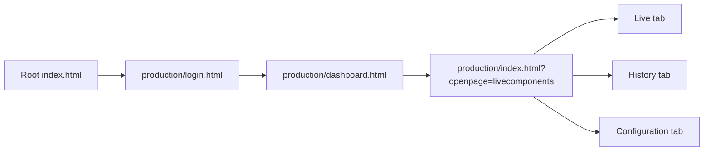

# Svasthya CMC

Svasthya CMC is a static web application for remote patient monitoring. It is designed for doctor-facing workflows in which a doctor logs in, reviews assigned patients, opens a patient monitoring view, monitors live waveform and vital feeds, reviews history, and configures alert thresholds.

Company: TANTRAGYAAN - Unit of TANTROTTOLAN SOLUTIONS LLP

Hosted URL: https://bharathsindhe2003.github.io/Svasthya-CMC/production/login.html

## Overview

The application is built as a client-side Firebase application with no backend service in this repository. The UI is served as static HTML, CSS, and JavaScript files, while authentication and realtime data access are handled through Firebase.

Core use cases:

- Doctor login with Firebase Authentication
- Dashboard view for patients assigned to the logged-in doctor
- Live monitoring of ECG, PPG, respiration rate, EWS, and key vitals
- Historical trend review by hour, day, week, or custom range
- Threshold configuration for patient-specific alerting
- Realtime alert highlighting and audio notification when thresholds are breached
- Context popup screens for focused waveform review

## Application Flow



If the `openpage` query parameter is missing, the current implementation defaults to the Configuration section.

## Entry Pages

| Page                        | Purpose                                                                     |
| --------------------------- | --------------------------------------------------------------------------- |
| `index.html`                | Redirects to `production/login.html` for GitHub Pages hosting               |
| `production/login.html`     | Doctor authentication screen                                                |
| `production/dashboard.html` | Patient dashboard with a card-based overview                                |
| `production/index.html`     | Main patient workspace containing Live, History, and Configuration sections |

## Navigation and State Model

The application uses browser storage and query parameters instead of a router.

### Local storage keys

- `doctor_id`: Firebase authenticated user ID
- `docname`: doctor display name shown in the UI
- `doc_registerId`: registration ID used to match patients by `patients/{patientId}/docId`
- `patient_unique_id`: currently selected patient ID
- `patient_info`: cached patient list for dashboard and alert listeners
- `username`: remembered login email
- `password`: remembered login password
- `RadioButtonValue`: remembered state of the login checkbox

### Session storage keys

- `THRESHOLD_TRIGGERS`: active threshold alerts used to restore blinking alert state during the current browser session

### Query parameters

- `production/index.html?openpage=livecomponents`
- `production/index.html?openpage=historycomponents`
- `production/index.html?openpage=vitalscomponents`

The context popup pages use base64-encoded query values:

- `param1`: timestamp in seconds
- `param2`: patient ID
- `param3`: page mode marker

Base64 is only obfuscation. It is not a security mechanism.

## Technology Stack

### Core platform

- HTML5
- CSS3
- Vanilla JavaScript with ES modules
- Firebase Web SDK v8

### UI and utilities

- Bootstrap
- jQuery
- Font Awesome
- Toastify
- NProgress
- Bootstrap Date Range Picker

### Charts and data visualization

- ECharts for live and historical charts
- Chart.js is bundled and available in the repository
- Flot and several chart-related vendor libraries are also present

## Repository Structure

This repository is organized as a static web application. The folder names below are the actual runtime paths used by the codebase.

```text
.
|- .nojekyll
|- index.html
|- README.md
|- build/
|  |- assests/
|  |  |- aduio2.mp3
|  |- css/
|  |- js/
|- production/
|  |- login.html
|  |- dashboard.html
|  |- index.html
|  |- context_assment.html
|  |- context_ecg.html
|  |- images/
|- vendors/
```

Notes:

- `build/` contains the runtime CSS and JavaScript used by the application. Despite the name, there is no build pipeline in this repository.
- `production/` contains the runtime HTML pages used by the application. Despite the name, there is no production pipeline or CI/CD setup in this repository.

## Front-End JS Module Map

### Authentication

- `build/js/login/login.js`: Handles login submission, browser checks, internet status checks, Firebase Authentication, doctor role validation, and remember-me behavior.

### Dashboard

- `build/js/dashboard/dashboard-custom.js`: Loads patients linked to the logged-in doctor, fetches current vitals and latest waveform snapshots, and prepares dashboard card data.
  - When the page renders, listeners are attached for each patient UUID assigned to the logged-in doctor.
  - The module listens to `patientlivedata7s/{uuid}`, `ECG_plot/{uuid}`, `PPG_plot/{uuid}`, `RR_plot/{uuid}`, and `EWS/{uuid}`.
  - When live data is unavailable or stale, the UI falls back to the latest valid records in `patientlivedata/{uuid}`, `patientecgdata/{uuid}`, `patientppgdata/{uuid}`, and `patientrrdata/{uuid}`.
- `build/js/dashboard/Dashboard-UI.js`: Renders patient cards and card interactions.

### Shared navigation and patient context

- `build/js/LeftandTopNavigation/LeftandTopNavigation.js`: Populates doctor and patient identity details, handles logout, and binds the profile menu UI.

### Live monitoring

- `build/js/livepage/database_function.js`: Initializes Firebase, connects live page widgets, loads current patient data, and manages waveform placeholders and timestamps.
  - When the page renders, listeners are attached to `patientlivedata7s/{current_patient_id}`, `ECG_plot/{current_patient_id}`, `PPG_plot/{current_patient_id}`, `RR_plot/{current_patient_id}`, and `EWS/{current_patient_id}`.
  - When required, last valid records are retrieved from `patientlivedata/{current_patient_id}`, `patientecgdata/{current_patient_id}`, `patientppgdata/{current_patient_id}`, and `patientrrdata/{current_patient_id}`.
- `build/js/livepage/live-custom.js`: Formats and pushes live vital values into the UI layer.
- `build/js/livepage/EchartGraphs.js`: Provides placeholder chart states when live waveform data is unavailable.

### History

- `build/js/history/option-module.js`: Provides time-range controls for hour, day, week, and custom ranges.
- `build/js/history/history_fb_module.js`: Fetches historical vital, ECG, and threshold-trigger data for the selected patient and time window.
- `build/js/history/history_UI_module.js`: Renders the history charts and launches context popup windows.

### Context assessment popup

- `build/js/context_assessment/context_assessment_UI.js`: Loads the selected timestamp snapshot for a patient, fills context vitals and EWS values, and renders ECG, PPG, and respiration waveform charts or no-data states in the assessment popup.

### Context ECG popup

- `build/js/context_ecg/context_ecg.js`: Loads the selected timestamp ECG payload for alert and history drill-down views, formats the capture date and time, and renders the ECG-only popup chart with reset and no-data handling.

### Threshold configuration and alerts

- `build/js/vitals/vitals_module.js`: Loads and saves patient-specific threshold rules for SpO2, heart rate, temperature, respiratory rate, systolic BP, and diastolic BP.
- `build/js/utils/Threshold_triggers.js`: Listens for new threshold-trigger records, applies blink states to patient cards, and controls alert sound playback.

### Utilities

- `build/js/backend/toastmsg.js`: Handles toast notifications.
- `build/js/utils/echarts-auto-resize.js`: Provides automatic chart resizing support.

## Front-End HTML Roadmap

### Entry point

- `index.html`: Root landing page that immediately redirects the browser to `production/login.html`.For GitHub Pages Hosting.

### Runtime pages

- `production/login.html`: Doctor login page with the Svasthya brand panel, credential form, remember-me option, and login script entry point.
- `production/dashboard.html`: Patient overview page that shows doctor identity, patient cards, alert sound and lightbox containers, and dashboard card interactions.
- `production/index.html`: Main patient workspace shell that combines shared navigation with the live monitoring, history, and threshold-configuration sections selected through the `openpage` query parameter.
- `production/context_assment.html`: Context assessment popup page for timestamp-based review of ECG, PPG, RR, vitals, and EWS details.
- `production/context_ecg.html`: Focused ECG popup page for timestamp-based alert and history drill-down when only the ECG view is needed.

## Front-End CSS Roadmap

### Shared shell and overlays

- `build/css/LeftandTopNavigation.css`: Shared navigation, header, sidebar, profile, and shell styling used by the dashboard and main patient workspace.
- `build/css/lightbox.css`: Reusable lightbox and popup container styling for image, chart, and iframe overlays.
- `build/css/incomingDialogbox.css`: Modal and incoming dialog styling used around dashboard and main workspace popup flows.

### Page-specific layouts

- `build/css/login-custom.css`: Branded login layout, login card, form field, password toggle, and responsive authentication page styling.
- `build/css/DashbordRightColomn.css`: Dashboard patient card grid, right-column layout, and dashboard-specific content styling.
- `build/css/LiveRightColomn.css`: Live monitoring page layout for waveform cards, vital cards, the EWS panel, and responsive main workspace alignment.
- `build/css/HistoryRightColomn.css`: History page layout, chart containers, filters, modal iframe presentation, and trend review styling loaded by the main workspace page.
- `build/css/vital.css`: Threshold configuration and vital settings layout inside the main patient workspace.

### Context popup layouts

- `build/css/context_assment_LeftandTopNavigation.css`: Shared shell styling for context popup pages.
- `build/css/context_assment_LiveRightColomn.css`: Context assessment and context ECG layout styling for popup charts, vitals, and focused review panels.

### Legacy or unused bundle

- `build/css/custom.min.css`: Bundled theme stylesheet that is currently commented out in `production/index.html` and is not part of the active runtime styling path.

## Firebase Integration

Firebase is initialized in `build/js/livepage/database_function.js`. The app currently contains a hardcoded Firebase configuration for a live project, plus a commented staging configuration.

### Firebase services used

- Firebase Authentication
- Firebase Realtime Database
- Firebase Analytics
- Firebase Messaging scripts are loaded in some pages

### Authentication model

- Users sign in with email and password
- After sign-in, the app verifies `roles/{uid}/role`
- Only users whose role is `Doctor` are allowed through to the dashboard

### Realtime Database model

The following database nodes are read by the current implementation.

```text
roles/{uid}
doctors/{uid}
patients/{patientId}

patientlivedata7s/{patientId}
patientlivedata/{patientId}/{timestamp}

ECG_plot/{patientId}
PPG_plot/{patientId}
RR_plot/{patientId}

patientecgdata/{patientId}/{timestamp}
patientppgdata/{patientId}/{timestamp}
patientrrdata/{patientId}/{timestamp}

EWS/{patientId}/{timestamp}
Threshold_Default/{patientId}/{vitalKey}
threshold_triggers/{patientId}/{timestamp}
```

### What each node is used for

- `doctors/{uid}`: doctor profile, including `username` and `registerId`
- `patients/{patientId}`: patient profile and doctor linkage through `docId`
- `patientlivedata7s/{patientId}`: latest aggregated live vital snapshot used by the dashboard and live monitoring, and as a connectivity indicator
- `patientlivedata/{patientId}/{timestamp}`: historical vital records and last valid fallback data used by the dashboard, live monitoring, history, and context views
- `ECG_plot`, `PPG_plot`, `RR_plot`: latest waveform payloads for the live and dashboard experience
- `patientecgdata`, `patientppgdata`, `patientrrdata`: timestamped waveform history and last valid fallback records
- `EWS/{patientId}/{timestamp}`: timestamped EWS records and visual severity state
- `Threshold_Default/{patientId}/{vitalKey}`: saved threshold configuration for the selected patient
- `threshold_triggers/{patientId}/{timestamp}`: alert events that drive card blinking, audio playback, and alert history markers

### Realtime Database node structures

The structures below combine the fields currently dereferenced by the web app with the additional fields documented in the SDD. Additional keys may exist in Firebase, but the examples below cover the schema the project expects or already documents.

#### Authentication and assignment

`roles/{uid}`

```text
roles
   <firebase-auth-uid>
      role: "Doctor"
```

Used during login to allow only doctor accounts into the dashboard.

`doctors/{uid}`

```text
doctors
   <firebase-auth-uid>
      email: "doctor@example.com"
      id: "<firebase-auth-uid>"
      lname: "Rao"
      mobile: "9999999999"
      password: "<documented-profile-value>"
      registerId: "DOC-001"
      surname: "R"
      username: "Doctor Name"
```

Used after login to store the doctor's display name and registration ID in local storage.

`patients/{patientId}`

```text
patients
   <patient-uuid>
      age: "54"
      ailment: "Cardiac observation"
      docId: "<doctor-registerId>"
      email: "patient@example.com"
      gender: "Male"
      height: "172"
      id: "<patient-uuid>"
      lname: "Kumar"
      mobile: "9999999999"
      mode: "live"
      password: "<documented-profile-value>"
      surname: "K"
      username: "Patient Name"
      weight: "68"
```

Used by the dashboard to fetch the patient list assigned to the logged-in doctor.

#### Live device and vital nodes

`patientlivedata7s/{patientId}`

```text
patientlivedata7s
   <patient-uuid>
      acc: "0"
      battery: "87"
      bp: "120/80"
      hr: "7200"
      pat: "0"
      rr: "18"
      spo: "9800"
      temp: "36.7"
      timestamp: 1712649000
      userId: "<patient-uuid>"
```

Used by the dashboard and live page for the latest aggregated vital snapshot and to infer live device availability.

`ECG_plot/{patientId}`

```text
ECG_plot
   <patient-uuid>
      timestamp: 1712649000
      ecg: "[12,13,14][15,16,17]..."
      type: "normal"
```

When the device is connected and ECG data is streaming, this node is updated under the patient UUID. Listeners use it to determine whether the device is connected and to fetch the latest `timestamp`, `ecg`, and `type` values. If `type` is `noise` or `flat`, the current UI treats the waveform as unavailable.

`PPG_plot/{patientId}`

```text
PPG_plot
   <patient-uuid>
      timestamp: 1712649000
      ppg: "101 102 103 104 ..."
```

Used as the live PPG stream node for the dashboard and live page.

`RR_plot/{patientId}`

```text
RR_plot
   <patient-uuid>
      timestamp: 1712649000
      res: "21 22 20 19 ..."
```

Used as the live respiration waveform node for the dashboard and live page.

#### Historical vital and waveform nodes

`patientlivedata/{patientId}/{timestamp}`

```text
patientlivedata
   <patient-uuid>
      <unix-timestamp>
         acc: "0"
         battery: "87"
         bp: "120/80"
         hr: "7200"
         pat: "0"
         rr: "18"
         spo: "9800"
         temp: "36.7"
         timestamp: 1712649000
         userId: "<patient-uuid>"
```

Used by the history page, context assessment popup, and live or dashboard fallback logic.

`patientecgdata/{patientId}/{timestamp}`

```text
patientecgdata
   <patient-uuid>
      <unix-timestamp>
         payload: "[12,13,14][15,16,17]..."
         timestamp: 1712649000
         type: "normal"
         userId: "<patient-uuid>"
```

Used for timestamp-based ECG history, ECG context popups, and last valid ECG fallback data.

`patientppgdata/{patientId}/{timestamp}`

```text
patientppgdata
   <patient-uuid>
      <unix-timestamp>
         payload: "101 102 103 104 ..."
         timestamp: 1712649000
         userId: "<patient-uuid>"
```

Used for timestamp-based PPG history, context assessment, and last valid PPG fallback data.

`patientrrdata/{patientId}/{timestamp}`

```text
patientrrdata
   <patient-uuid>
      <unix-timestamp>
         payload: "21 22 20 19 ..."
         timestamp: 1712649000
         userId: "<patient-uuid>"
```

Used for timestamp-based respiration waveform history, context assessment, and last valid RR fallback data.

#### EWS, threshold, and alert nodes

`EWS/{patientId}/{timestamp}`

```text
EWS
   <patient-uuid>
      <unix-timestamp>
         color: "#ff8a00"
         doc_id: "DOC-001"
         ews_score: 5
         timestamp: 1712649000
```

The latest child node is used on the dashboard and live page. The exact timestamp child is used in the context assessment popup.

`Threshold_Default/{patientId}`

```text
Threshold_Default
   <patient-uuid>
      spo2
         typ: "<" | ">" | "<>" | ""
         val1: "90"
         val2: ""
      hr
         typ: "<" | ">" | "<>" | ""
         val1: "50"
         val2: "120"
      temp
         typ: "<" | ">" | "<>" | ""
         val1: "35.5"
         val2: "38.5"
      rr
         typ: "<" | ">" | "<>" | ""
         val1: "10"
         val2: "24"
      sbp
         typ: "<" | ">" | "<>" | ""
         val1: "90"
         val2: "140"
      dbp
         typ: "<" | ">" | "<>" | ""
         val1: "60"
         val2: "90"
      timestamp: "1712649000"
```

Type codes used by the current UI:

- `<`: less than
- `>`: greater than
- `<>`: between
- empty string (`""`): disabled or not configured

Legacy blood-pressure data can also exist in the older combined format below, and the current UI still reads it as a fallback:

```text
Threshold_Default
   <patient-uuid>
      bp
         Min: "90/60"
         Max: "140/90"
```

`threshold_triggers/{patientId}/{timestamp}`

```text
threshold_triggers
   <patient-uuid>
      <unix-timestamp>: "HR,SPO2"
```

Each timestamp child currently stores a comma-separated string of triggered vitals. New child entries are used to start dashboard blink states and alert sound playback.

### Important implementation detail

The dashboard filters patients by comparing:

- `doctors/{uid}/registerId`
- `patients/{patientId}/docId`

This means patient-to-doctor assignment in the database is based on the doctor's registration ID, not the Firebase auth UID.

## Threshold Configuration Model

Threshold rules are saved per patient and per vital in `Threshold_Default/{patientId}`.

Supported vitals:

- `spo2`
- `hr`
- `temp`
- `rr`
- `sbp`
- `dbp`

Supported rule styles in the UI:

- Less than
- Greater than
- In between

The UI stores condition metadata plus value fields such as `val1`, `val2`, and `typ` depending on the rule shape. When the rule type is In between, both `val1` and `val2` are required; otherwise, only `val1` is required.

## User Experience Summary

### Login

- Checks browser compatibility and recommends Chrome
- Shows internet connectivity warnings
- Supports remember-me by caching email and password in local storage

### Dashboard

- Displays all patients assigned to the logged-in doctor
- Shows current vitals, EWS, and waveform snapshots per patient
- Plays an alert sound and adds blink states when threshold events arrive
- Selecting a patient stores `patient_unique_id` and opens the Live section

### Patient workspace

The main workspace in `production/index.html` contains three sections:

- Live: realtime ECG, PPG, RR, EWS, and vitals
- History: granular and consolidated historical chart views with selectable time windows
- Configuration: patient threshold configuration UI

### Context views

- `context_assment.html` shows a full timestamp-specific context including waveform and vitals
- `context_ecg.html` shows ECG only

## Local Development

### Prerequisites

- A Firebase project configured for Authentication and Realtime Database
- A modern browser with ES module support
- Internet access for CDN-hosted dependencies
- A static web server

Chrome is explicitly recommended by the current login script.

## Deployment Notes

This project is already structured for GitHub Pages style deployment.

- `.nojekyll` is included
- Root `index.html` redirects to `production/login.html`
- All runtime assets are loaded through relative paths
- The existing directory structure must be preserved

## Version History

### Version 0.1.11 - 30-03-2026

- Updated the UI in the dashboard, patient cards, live page, and login page

### Version 0.1.10 - 24-03-2026

- Resolved an EWS score issue

### Version 0.1.8 - 24-03-2026

- Added listeners to both dashboard and live page
- Added empty string handling for threshold triggers
- Added CSS adjustments for TV screen layouts
- Resolved EWS score issues
- Resolved undefined values appearing on newly created patient cards
- Resolved missing chart plotting for alert thresholds

### Version 0.1.7 - 23-03-2026

- Removed activity from history
- Removed notification and video files and related code

### Version 0.1.5 - 23-03-2026

- Fixed SpO2 not displaying in history
- Applied two UI changes

### Version 0.1.1 - 18-03-2026

- Removed double-click behavior from history charts
- Rounded temperature to two decimal places in history
- Resolved flickering on the dashboard page
- Resolved battery icon visibility issue
- Redesigned the dashboard patient card
- Redesigned the history tab

### Version 0.1.0 - 17-03-2026

- Used the Svasthya Playstore Respiration version as the base
- Added blinking and sound effects for patient cards when vitals cross thresholds
- Redesigned the Configuration tab

## License

This project is distributed under the terms described in `LICENSE`.
