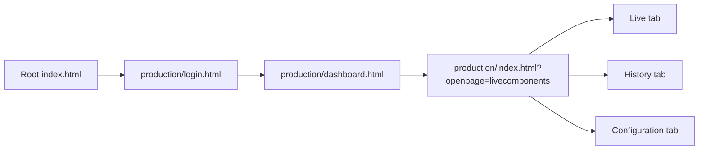

# Svasthya CMC

Svasthya CMC is a static web application for remote patient monitoring. It is designed for doctor-facing workflows where a clinician signs in, reviews assigned patients, opens a patient monitoring view, watches live waveform and vital feeds, reviews history, and configures alert thresholds.

Company: TANTRAGYAAN - Unit of TANTROTTOLAN SOLUTIONS LLP

Hosted URL: https://bharathsindhe2003.github.io/Svasthya-CMC/production/login.html

## Overview

The application is built as a client-side Firebase application with no backend service inside this repository. The UI is served as static HTML, CSS, and JavaScript files, while authentication and realtime data access are handled through Firebase.

Core use cases:

- Doctor login with Firebase Authentication
- Dashboard view for patients assigned to the logged-in doctor
- Live monitoring of ECG, PPG, respiration rate, EWS, and key vitals
- Historical trend review by hour, day, week, or custom range
- Threshold configuration for patient-specific alerting
- Realtime alert highlighting and audio notification when thresholds are breached
- Context popup screens for focused waveform review

## Application Flow



## Entry Pages

| Page                        | Purpose                                                                     |
| --------------------------- | --------------------------------------------------------------------------- |
| `index.html`                | Redirects to `production/login.html` for GitHub Pages hosting               |
| `production/login.html`     | Doctor authentication screen                                                |
| `production/dashboard.html` | Patient dashboard with card-based overview                                  |
| `production/index.html`     | Main patient workspace containing Live, History, and Configuration sections |

## Navigation And State Model

The application uses browser storage and query parameters instead of a router.

### Local storage keys

- `doctor_id`: Firebase authenticated user id
- `docname`: doctor display name shown in the UI
- `doc_registerId`: registration id used to match patients by `patients/{patientId}/docId`
- `patient_unique_id`: currently selected patient id
- `patient_info`: cached patient list for dashboard and alert listeners
- `username`: remembered login email
- `password`: remembered login password
- `RadioButtonValue`: remembered state of the login checkbox

### Session storage keys

- `THRESHOLD_TRIGGERS`: active threshold alerts used to restore blinking alert state during the current browser session

### Query parameters

- `production/index.html?openpage=livecomponents`
- `production/index.html?openpage=historycomponents`
- `production/index.html?openpage=vitalscomponents`

If `openpage` is missing, the current implementation defaults to the Configuration section.

The context popup pages use base64-encoded query values:

- `param1`: timestamp in seconds
- `param2`: patient id
- `param3`: page mode marker

Base64 is only obfuscation. It is not a security mechanism.

## Technology Stack

### Core platform

- HTML5
- CSS3
- Vanilla JavaScript with ES modules
- Firebase Web SDK v8

### UI and utilities

- Bootstrap
- jQuery
- Font Awesome
- Toastify
- NProgress
- Bootstrap Date Range Picker

### Charts and data visualization

- ECharts for live and historical charts
- Chart.js is bundled and available in the repository
- Flot and several chart-related vendor libraries are also present

## Repository Structure

This repository is organized as a static web app. The folder names below are the actual runtime paths used by the codebase.

```text
.
|- .nojekyll
|- index.html
|- README.md
|- build/
|  |- assests/
|  |  |- aduio2.mp3
|  |- css/
|  |- js/
|- production/
|  |- login.html
|  |- dashboard.html
|  |- index.html
|  |- context_assment.html
|  |- context_ecg.html
|  |- images/
|- vendors/
```

Notes:

- `build/` contains the runtime CSS and JavaScript used by the application. Despite the name, there is no build pipeline in this repository.

## Front-End Module Map

### Authentication

- `build/js/login/login.js`: handles login submission, browser check, internet status check, Firebase Authentication, doctor role validation, and remember-me behavior

### Dashboard

- `build/js/dashboard/dashboard-custom.js`: loads patients linked to the logged-in doctor, fetches current vitals and latest waveform snapshots, and prepares dashboard card data
- `build/js/dashboard/Dashboard-UI.js`: renders patient cards and card interactions

### Shared navigation and patient context

- `build/js/LeftandTopNavigation/LeftandTopNavigation.js`: populates doctor and patient identity details, handles logout, and binds profile menu UI

### Live monitoring

- `build/js/livepage/database_function.js`: initializes Firebase, connects live page widgets, loads current patient data, and manages waveform placeholders and timestamps
- `build/js/livepage/live-custom.js`: formats and pushes live vital values into the UI layer
- `build/js/livepage/EchartGraphs.js`: placeholder chart states when live waveform data is unavailable

### History

- `build/js/history/option-module.js`: time-range controls for hour, day, week, and custom range
- `build/js/history/history_fb_module.js`: fetches historical vital, ECG, and threshold-trigger data for the selected patient and time window
- `build/js/history/history_UI_module.js`: renders the history charts and launches context popup windows

### Threshold configuration and alerts

- `build/js/vitals/vitals_module.js`: loads and saves patient-specific threshold rules for SpO2, heart rate, temperature, respiratory rate, systolic BP, and diastolic BP
- `build/js/utils/Threshold_triggers.js`: listens for new threshold-trigger records, applies blink states to patient cards, and controls alert sound playback

### Utilities

- `build/js/backend/toastmsg.js`: toast notifications
- `build/js/utils/echarts-auto-resize.js`: automatic chart resizing support

## Firebase Integration

Firebase is initialized in `build/js/livepage/database_function.js`. The app currently contains a hardcoded Firebase configuration for a live project, plus a commented staging configuration.

### Firebase services used

- Firebase Authentication
- Firebase Realtime Database
- Firebase Analytics
- Firebase Messaging scripts are loaded in some pages

### Authentication model

- Users sign in with email and password
- After sign-in, the app verifies `roles/{uid}/role`
- Only users whose role is `Doctor` are allowed through to the dashboard

### Realtime Database model

The following database nodes are read by the current implementation.

```text
roles/{uid}
doctors/{uid}
patients/{patientId}

patientlivedata7s/{patientId}
patientlivedata/{patientId}/{timestamp}

ECG_plot/{patientId}
PPG_plot/{patientId}
RR_plot/{patientId}

patientecgdata/{patientId}/{timestamp}
patientppgdata/{patientId}/{timestamp}
patientrrdata/{patientId}/{timestamp}

EWS/{patientId}/{timestamp}
Threshold_Default/{patientId}/{vitalKey}
threshold_triggers/{patientId}/{timestamp}
```

### What each node is used for

- `roles/{uid}`: role guard during login
- `doctors/{uid}`: doctor profile, including `username` and `registerId`
- `patients/{patientId}`: patient profile and doctor linkage through `docId`
- `patientlivedata7s/{patientId}`: latest aggregated live vital snapshot used by dashboard and live monitoring
- `patientlivedata/{patientId}/{timestamp}`: historical vital records used by history and context views
- `ECG_plot`, `PPG_plot`, `RR_plot`: latest waveform payloads for the live/dashboard experience
- `patientecgdata`, `patientppgdata`, `patientrrdata`: timestamped waveform history
- `EWS/{patientId}/{timestamp}`: timestamped EWS records and visual severity state
- `Threshold_Default/{patientId}/{vitalKey}`: saved threshold configuration for the selected patient
- `threshold_triggers/{patientId}/{timestamp}`: alert events that drive card blinking and session alert state

### Important implementation detail

The dashboard filters patients by comparing:

- `doctors/{uid}/registerId`
- `patients/{patientId}/docId`

This means patient-to-doctor assignment in the database is based on the doctor's registration id, not the Firebase auth uid.

## Threshold Configuration Model

Threshold rules are saved per patient and per vital in `Threshold_Default/{patientId}`.

Supported vitals:

- `spo2`
- `hr`
- `temp`
- `rr`
- `sbp`
- `dbp`

Supported rule styles in the UI:

- Less than
- Greater than
- In between

The UI stores condition metadata plus value fields such as `Min`, `Max`, `val1`, `val2`, and `typ` depending on the rule shape.

## User Experience Summary

### Login

- Checks browser compatibility and recommends Chrome
- Shows internet connectivity warnings
- Supports remember-me by caching email and password in local storage

### Dashboard

- Displays all patients assigned to the logged-in doctor
- Shows current vitals, EWS, and waveform snapshots per patient
- Plays an alert sound and adds blink states when threshold events arrive
- Selecting a patient stores `patient_unique_id` and opens the Live section

### Patient workspace

The main workspace in `production/index.html` contains three sections:

- Live: realtime ECG, PPG, RR, EWS, and vitals
- History: granular and consolidated historical chart views with selectable time windows
- Configuration: patient threshold configuration UI

### Context views

- `context_assment.html` shows a full timestamp-specific context including waveform and vitals
- `context_ecg.html` shows ECG only

## Local Development

### Prerequisites

- A Firebase project configured for Authentication and Realtime Database
- Modern browser with ES module support
- Internet access for CDN-hosted dependencies
- A static web server

Chrome is explicitly recommended by the current login script.

## Deployment Notes

This project is already structured for GitHub Pages style deployment.

- `.nojekyll` is included
- Root `index.html` redirects to `production/login.html`
- All runtime assets are loaded through relative paths
- The existing directory structure must be preserved

## Version History

### Version 0.1.11 - 30-03-2026

- Updated the UI in the dashboard, patient cards, live page, and login page

### Version 0.1.10 - 24-03-2026

- Resolved an EWS score issue

### Version 0.1.8 - 24-03-2026

- Added listeners to both dashboard and live page
- Added empty string handling for threshold triggers
- Added CSS adjustments for TV screen layouts
- Resolved EWS score issues
- Resolved undefined values appearing on newly created patient cards
- Resolved missing chart plotting for alert thresholds

### Version 0.1.7 - 23-03-2026

- Removed activity from history
- Removed notification and video files and related code

### Version 0.1.5 - 23-03-2026

- Fixed SpO2 not displaying in history
- Applied two UI changes

### Version 0.1.1 - 18-03-2026

- Removed double-click behavior from history charts
- Rounded temperature to two decimal places in history
- Resolved flickering on the dashboard page
- Resolved battery icon visibility issue
- Redesigned the dashboard patient card
- Redesigned the history tab

### Version 0.1.0 - 17-03-2026

- Used the Svasthya Playstore Respiration version as the base
- Added blinking and sound effects for patient cards when vitals cross thresholds
- Redesigned the Configuration tab

## License

This project is distributed under the terms described in `LICENSE`.
